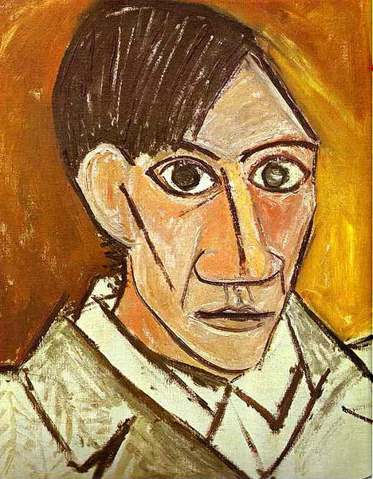
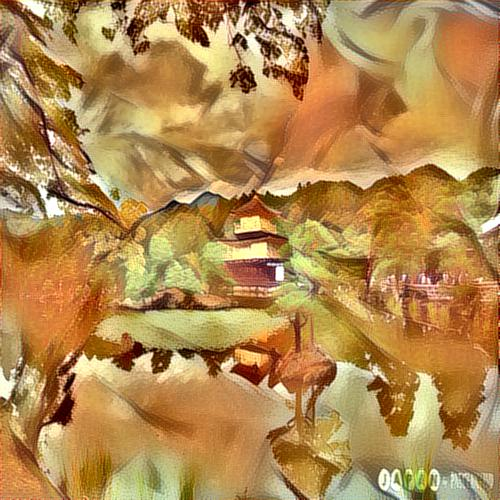

# Style Transfer 

This is my attempt to implement style transfer to an image from an image with a particular style. 

# Table of Contents

*  [*Problem*](#org9124e2a)
*  [*High Level Steps*](#org2b3434d)
    *  [*Recommended Overview  of the steps generally followed*](#org25df29c)
        *  [**This problem consists of two sub problems:**](#org8d922c8)
*  [*Content Image* : Japanese-garden](#org7199751)
*  [*Style image*   :  Picasso-style](#orgbdd1c6b)
*  [*Output image*   :  Picasso-style-content](#org3737281)

# CHALLENGE EXERCISE
###  *Problem*

Objective  is to apply the style of an image, which we will term as
"style image" to a target image while preserving the content of the
target image.

-   ***Style*** is textures and visual patterns in an image. Example is brush strokes of an artist
-   ***Content*** is the macro structure of an image, like buildings, people, objects in the content of the image.

###  *High Level Steps*

-   choose the image to style
-   choose the style reference image (here we have provided a Picasso style image)
-   choose a pre-trained deep neural network (CNN type) and obtain feature representations of intermediate layers. This step is done
    to achieve the representations of both the content image and style image. For the content image, best option is to obtain the feature
    representations of highest layers as they would contain information on the image macro-structure. For the style reference image, feature
    representations are obtained from multiple layers at different scales.
-   define loss function
-   **Loss function** should be taking into account the **Content-loss**, **Style-loss**, **Variation-loss**.
-   _*Optimize on each iteration to minimize the loss*_

## ___**Recommended Overview  of the steps generally followed**___

-   Create a random input image
-   Pass the input through a pre-trained backbone architecture 
-   Calculate loss and compute the gradients w.r.t input image pixels. Hence only the input pixels are adjusted whereas the
    weights remain constant.

##  ___**This problem consists of two sub problems:**___

*  *to generate the content*    and 

*  *to generate the style*

###  *SubProblem — 1. Generate Content* 

    The problem is to produce an image that contains a content as in the
    content image.
    
    **General Guideline** 
    One point to note here is that the image should only contain the
    content(as in a rough sketch of the content image and not the texture
    from the content image, since the output should contain a style
    different from the style image)

###  *SubProblem — 2. Generate Style*

    The problem is to produce an image which contains the style as in the
    style image.  
    
    **General Guideline**
    Compute ****MSE loss between gram matrix of input and the style image**** and
    you should be good to generate an input image with the required style.
    Publish the model details, output results and model metrics.

### *Content Image* : 

### *Style image*   : 

### *Output image* : 

